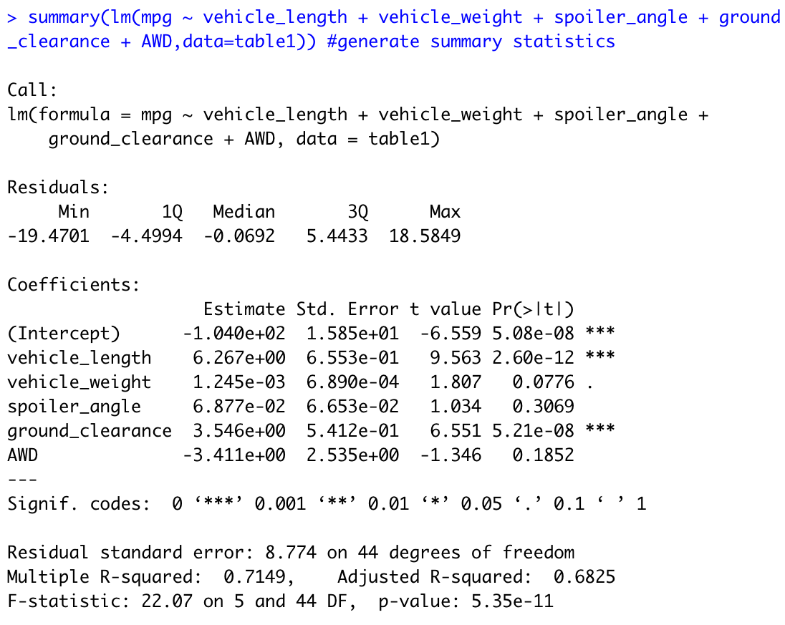
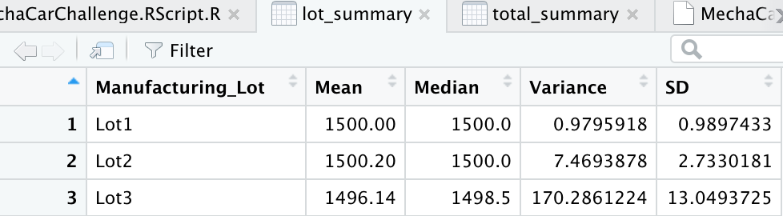
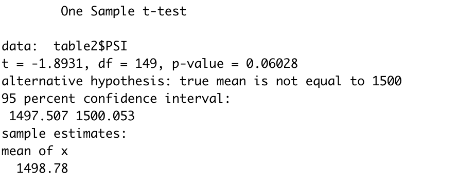
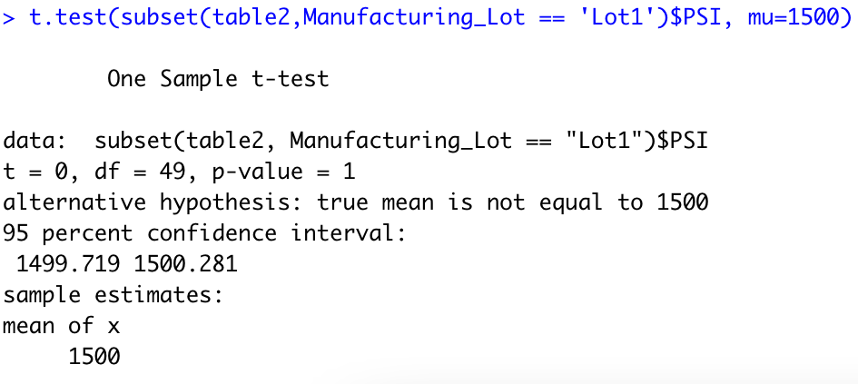
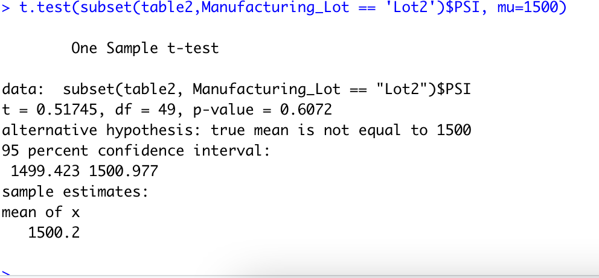
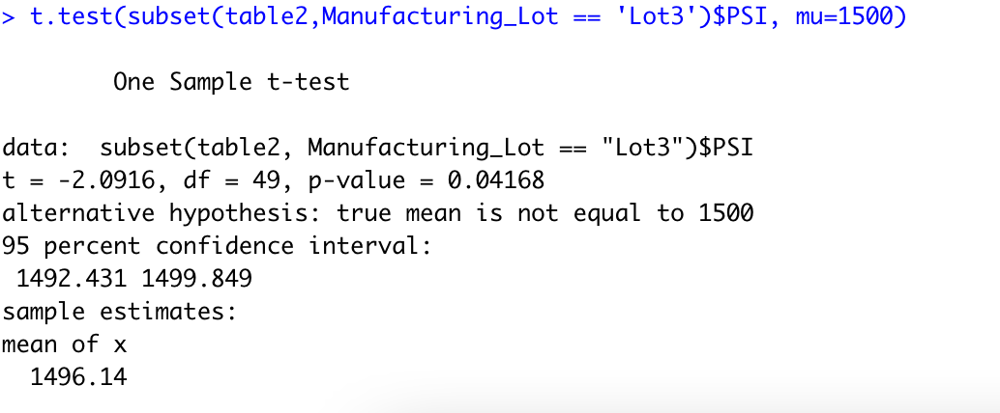

# MechaCar_Statistical_Analysis

## Linear Regression to Predict MPG

- Which variables/coefficients provided a non-random amount of variance to the mpg values in the dataset?  
Based on the Pr(>|t|) values of each variable, vehicle length, ground clearence, and the intercept provided a non-random amount of variance to the mpg values in the dataset. 

- Is the slope of the linear model considered to be zero? Why or why not?  
The slope of the linear model is not zero because the p-value is extremely low (5.35e-11) which indicates that the probability thaat these variables are not related is very small.

- Does this linear model predict mpg of MechaCar prototypes effectively? Why or why not?  
Since the r-squared value is 0.7149, this linear model does a good job of predicting mpg of MechaCar prototypes. Based on the r-squared value, the model will predict mpg values correctly l71.49% of the time. See images of the regression and summary statistics below: 

### Linear Regression
     

### Summary Statistics
           

## Summary Statistics on Suspension Coils

Based on the summary statistics for suspension coils, the data for overall coil suspension does meet the design specifications of <100 pounds per square inch. As you can see in the image below: the variance is 62.29356.
     

As for the individual lots, only lot 3 does not meet design specifications because its variance is 170.2861224. This value is well over the variance limit of 100 pounds per square inch. As you can see in the image below, lots 1 and 2 meet the design specifications. 
       

## T-Tests on Suspension Coils

### Overall T-Test
The first t-test was conducted to to determine if the PSI across all manufacturing lots is statistically different from the population mean of 1,500 pounds per square inch. The p-value for this test is 0.06028. Since the p-value of 0.06028 is above our common significant level of .05, we do not have enough evidence to reject the null hypotethsis and the two means are statistically similar.  
      

### Lot 1 T-Test
This next  t-test was conducted to to determine if the PSI across each indivual manufacturing lot is statistically different from the population mean of 1,500 pounds per square inch. This T-Test is for Lot #1. The p-value for this test is 1. Since the p-value of 1 is above our common significant level of .05, we do not have enough evidence to reject the null hypotethsis and the two means are statistically similar.  
       

### Lot 2 T-Test
This next  t-test was conducted to to determine if the PSI across each indivual manufacturing lot is statistically different from the population mean of 1,500 pounds per square inch. This T-Test is for Lot #2. The p-value for this test is 0.6072. Since the p-value of 10.6072 is above our common significant level of .05, we do not have enough evidence to reject the null hypotethsis and the two means are statistically similar.  
       

### Lot 3 T-Test
This next  t-test was conducted to to determine if the PSI across each indivual manufacturing lot is statistically different from the population mean of 1,500 pounds per square inch. This T-Test is for Lot #3. The p-value for this test is 0.04168. Since the p-value of 0.04168 is below our common significant level of .05, we have enough evidence to reject the null hypotethsis so the two means are not statistically similar.  
         

## Study Design: MechaCar vs Competition
- What metric or metrics are you going to test
I am going to test if there is a difference in the mean of the cost of Mechacar vs the competition(population values).

- What is the null hypothesis or alternative hypothesis?  
Null Hypotheses(H0) - There is no statistical difference between the mean cost of Mechacar and its competition.
Alternative Hypothesis - There is a statistical difference between the mean costt of Mechacar and its competition. 

- What statistical test would you use to test the hypothesis? And why?  
I would use a one-sample t-test because. In this test, there is one dichotomous independent variable (MechaCar vs Population) and a continuous dependent variable (safety rating). 

- One-sample t-tests asks "Is there a statistical difference between the mean of the sample distribution and the mean of the population distribution?".   For the purpose of our test, we want to identify if there is a statistically significant difference between mean population and mean sample cost. 

- What data is needed to run the statistical test?  
We would need the individual cost of MechaCar vehicles and the mean safety rating of all MechaCar vehicles to compare. 
